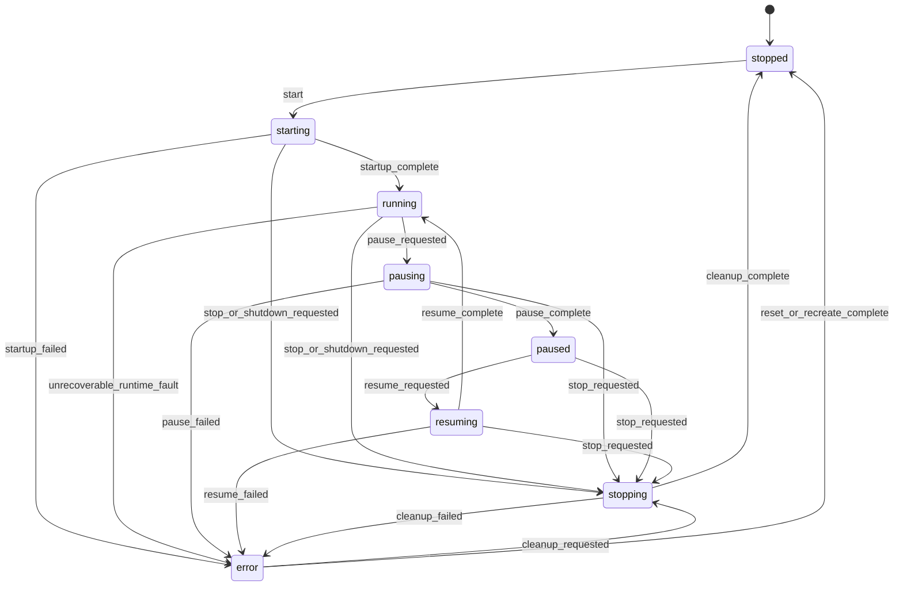

# NTPRO Node Lifecycle State Machine

Date: 2026-06-04
Executor: Codex
Task ID: NARCH-003

## Purpose

This document defines the stable node lifecycle contract for the Rust-only
NTPRO architecture. It is intended for future dashboard, operator control, and
runtime status surfaces.

This is a contract document only. It does not change `LiveNode`, component
state transitions, dashboard controls, adapter behavior, or live trading
behavior.

## Runtime Anchors

The current Rust runtime has two relevant state layers:

| Runtime concept | Current source | Current states |
| --- | --- | --- |
| Live node handle state | `crates/live/src/node.rs` `NodeState` | `Idle`, `Starting`, `Running`, `ShuttingDown`, `Stopped` |
| Component lifecycle state | `crates/common/src/enums.rs` `ComponentState` and `crates/common/src/component.rs` transition table | `PreInitialized`, `Ready`, `Starting`, `Running`, `Stopping`, `Stopped`, `Resuming`, `Resetting`, `Disposing`, `Disposed`, `Degrading`, `Degraded`, `Faulting`, `Faulted` |
| Trader lifecycle orchestration | `crates/system/src/trader.rs` | initialize, start components, stop components, reset, dispose |
| Cross-thread live control | `crates/live/src/node.rs` `LiveNodeHandle` | stop flag plus atomic node state |

The contract states below are user/operator-facing lifecycle states. They are
not a promise that every state already exists as a runtime enum variant.

## Contract States

| State | Meaning | Current implementation mapping |
| --- | --- | --- |
| `stopped` | The node is not executing. It may be fresh, idle, or fully stopped after cleanup. | `NodeState::Idle` before first start and `NodeState::Stopped` after `finalize_stop`. |
| `starting` | Start has been requested and startup is in progress. Runner senders may be bound, kernel startup may run, and data/execution clients may connect. | `NodeState::Starting`; component states may be `Ready -> Starting -> Running`. |
| `running` | The node is active and can process runtime events according to its environment and adapter configuration. | `NodeState::Running`; trader/components are expected to be running or already started enough for the selected runtime path. |
| `pausing` | A future operator pause request is being applied. Runtime should stop accepting new trading actions while preserving readable status. | Future control contract only; no current `LiveNode` top-level pause state. |
| `paused` | A future operator pause has completed. Runtime status remains readable, but trading actions remain held or disabled. | Future control contract only; no current `LiveNode` top-level paused state. |
| `resuming` | A future operator resume request is being applied after a completed pause. | Future control contract only; component-level `Resuming` exists, but no current `LiveNode` top-level resume state. |
| `stopping` | Stop or shutdown is in progress. The runtime should reject new start/pause/resume requests and finish cleanup. | `NodeState::ShuttingDown`; component state may be `Stopping`. |
| `error` | Startup, runtime, lifecycle, or cleanup failed in a way that needs explicit operator decision or evidence. | Component `Faulting/Faulted`, startup abort/error, or stop failure classification. `LiveNode` does not currently expose a dedicated `Error` enum variant. |

`ComponentState::Degraded` remains a component diagnostic status. It should be
reported as a component health detail under `running` or `error`, not promoted
to a top-level node lifecycle state unless a later task explicitly changes the
contract.

## Transition Model

## Transition Rules

| From | Allowed next state | Trigger | Notes |
| --- | --- | --- | --- |
| `stopped` | `starting` | start | Fresh `Idle` and completed `Stopped` both map to contract `stopped`. |
| `starting` | `running` | startup complete | Current `LiveNode::start` sets `Running` after startup paths complete or after event-store replay setup. |
| `starting` | `stopping` | stop/shutdown during startup | Current startup abort can handle stop or shutdown requests. |
| `starting` | `error` | startup failure | Startup failure must preserve reason and component/client context. |
| `running` | `pausing` | pause requested | Future dashboard/control contract; not currently implemented as `LiveNode` state. |
| `running` | `stopping` | stop/shutdown requested | Current `LiveNode::stop` moves to `ShuttingDown` and finalizes stop. |
| `running` | `error` | unrecoverable runtime fault | Fault must be explicit and must not be hidden as healthy `running`. |
| `pausing` | `paused` | pause complete | Future contract. |
| `pausing` | `stopping` | stop requested | Stop takes precedence over pause completion. |
| `pausing` | `error` | pause failed | Future contract. |
| `paused` | `resuming` | resume requested | Future contract. |
| `paused` | `stopping` | stop requested | Pause does not block shutdown. |
| `resuming` | `running` | resume complete | Future contract. |
| `resuming` | `stopping` | stop requested | Stop takes precedence over resume completion. |
| `resuming` | `error` | resume failed | Future contract. |
| `stopping` | `stopped` | cleanup complete | Current `finalize_stop` sets `NodeState::Stopped`. |
| `stopping` | `error` | cleanup failed | Disconnect/finalization failures must surface in evidence/status. |
| `error` | `stopping` | cleanup requested | Recoverable cleanup path after fault. |
| `error` | `stopped` | reset/recreate complete | Operator-facing contract for a fully cleared fault. |

## Invalid Transition Expectations

Invalid transitions must be rejected or reported as idempotent according to the
operator action:

| Request | Invalid when | Expected result |
| --- | --- | --- |
| start | `starting`, `running`, `pausing`, `paused`, `resuming`, `stopping` | Reject with current state and requested action. Current `LiveNode::start` already rejects `Running` as `Already running`; future control should broaden this guard. |
| pause | `stopped`, `starting`, `stopping`, `error` | Reject with current state. Pause is not currently implemented and must not be advertised as available. |
| resume | Any state except `paused` | Reject with current state. |
| stop | `starting`, `running`, `pausing`, `paused`, `resuming`, `error` | Begin or continue cleanup. |
| stop | `stopped` | Treat as idempotent for operator control surfaces, or report already stopped without side effects. |
| direct state mutation | any public caller | Forbidden. Public control should request actions, never write lifecycle state directly. |

Direct transitions from `stopped` to `running`, `running` to `stopped`, and
`error` to `running` are forbidden. They must pass through the documented
intermediate states so evidence and operator status remain auditable.

## Error Handling Contract

Every lifecycle error must preserve enough context for a future read-only
dashboard and release evidence:

| Field | Requirement |
| --- | --- |
| current state | The state visible at the time of failure. |
| previous state | The last stable state before the transition started. |
| requested action | The action that triggered the transition. |
| failing component | Node, trader, data client, execution client, adapter, persistence, or other scoped component when known. |
| reason | Concise human-readable failure reason. |
| timestamp | Transition or failure timestamp when available. |
| cleanup status | Whether cleanup is pending, in progress, completed, or failed. |

Startup timeout, client connection failure, shutdown request during startup, and
cleanup failure must not be reported as a healthy completed start unless the
runtime explicitly documents that behavior and records the reason.

## Future Dashboard Fields

Future dashboard/control tasks may expose these read-only fields:

| Field | Meaning |
| --- | --- |
| `node_id` | Stable node identifier when available. |
| `trader_id` | Trader identifier. |
| `environment` | Backtest, sandbox, or live environment. |
| `lifecycle_state` | One of the contract states in this document. |
| `previous_state` | Last stable lifecycle state. |
| `requested_action` | Last requested lifecycle action. |
| `last_transition_at` | Timestamp of the latest transition. |
| `started_at` | Runtime start timestamp when available. |
| `stopped_at` | Runtime stop timestamp when available. |
| `last_error` | Structured error summary, without secrets. |
| `stop_reason` | Manual stop, shutdown signal, startup abort, fault cleanup, or unknown. |
| `data_clients` | Count or status summary, not adapter internals. |
| `execution_clients` | Count or status summary, not adapter internals. |

Dashboard surfaces must consume a future stable status contract. They must not
read mutable engine, cache, message-bus, or adapter internals directly.

## Current vs Future Scope

Current support:

- `LiveNode` exposes `Idle`, `Starting`, `Running`, `ShuttingDown`, and
  `Stopped`.
- `LiveNodeHandle` is the intended cross-thread control surface for stop/state
  observation.
- Component-level lifecycle already includes `Resuming`, `Faulting`, and
  `Faulted`.

Future contract only:

- Top-level node `pausing`, `paused`, `resuming`, and `error` states.
- Operator pause/resume actions.
- Dashboard-visible lifecycle status object.
- Control endpoints or UI controls.

Those future items require later tasks such as NARCH-004, NARCH-005, and
NDASH-001 before implementation.
