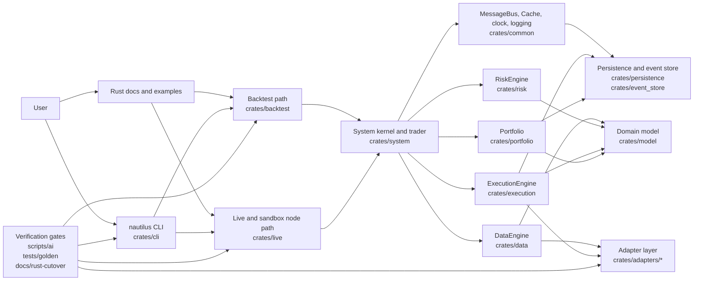

# NTPRO Rust-Only Architecture Map

Date: 2026-06-04
Executor: Codex
Task ID: NARCH-001

## Purpose

This document maps the current NTPRO Rust-only architecture after the
`ntpro-rust-only-v0.1.0` release and the first v0.2.0 hardening tasks.

It describes the current system shape only. It does not refactor crates,
change runtime behavior, or implement dashboard telemetry/control surfaces.

## System View



## Product Surface

| Surface | Current path | Status |
| --- | --- | --- |
| CLI | `crates/cli`, binary `nautilus` | Primary user-facing operational entrypoint. |
| Rust examples | `examples/rust`, `crates/backtest/examples`, `crates/live/examples` | Supported documentation and smoke path. |
| Rust docs | `docs/getting_started`, `docs/rust-cutover/product`, generated `cargo doc` output | Supported user guidance surface. |
| Source install | GitHub source checkout plus Cargo | Supported by NBIN-001. |
| Local CLI install | `cargo install --path crates/cli --bin nautilus --locked --force` | Supported by NBIN-001. |
| Python/PyO3/Cython | Removed from product surface | Not a supported user path. |
| Prebuilt binaries/Docker | Deferred | Not a v0.2.0 requirement. |

## Runtime Layers

### Node Runtime

| Layer | Crates | Responsibility |
| --- | --- | --- |
| Backtest runtime | `crates/backtest` | Historical simulation, backtest config, exchange simulation, execution client, result metadata, and `BacktestNode` path. |
| Live/sandbox runtime | `crates/live`, `crates/adapters/sandbox` | `LiveNode` build/start/stop path, sandbox execution client registration, lifecycle smoke without real orders. |
| System kernel and trader | `crates/system` | Kernel builder, component composition, trader lifecycle, actor/strategy ownership, start/stop orchestration. |

### Core Engines

| Component | Crate | Current responsibility |
| --- | --- | --- |
| DataEngine | `crates/data` | Data subscriptions, requests, aggregation, data routing, option-chain support, data client integration. |
| ExecutionEngine | `crates/execution` | Order routing, order manager, matching engine, order emulator, reconciliation, execution reports. |
| RiskEngine | `crates/risk` | Pre-trade checks, risk bypass rules, sizing boundaries, order rejection/approval paths. |
| Portfolio | `crates/portfolio` | Account state, positions, exposure, PnL, snapshots, portfolio updates from execution/account events. |
| MessageBus | `crates/common` | Pub/sub, command/event routing, typed endpoints, stubs, optional persistence configuration. |
| Cache | `crates/common` | Instruments, accounts, orders, positions, quotes, own order books, cache views and mutation boundaries. |

### Domain And Infrastructure

| Area | Crates | Current responsibility |
| --- | --- | --- |
| Domain model | `crates/model` | Instruments, orders, data events, account types, identifiers, enums, price/quantity/time domain values. |
| Core primitives | `crates/core` | Time, correctness helpers, string/identifier support, precision helpers, common primitives. |
| Trading actors | `crates/trading`, `crates/analysis`, `crates/indicators` | Strategies, actors, indicators, analysis helpers, execution algorithms. |
| Persistence | `crates/persistence`, `crates/event_store`, `crates/serialization` | Persistence boundaries, event-store encoding, serialization formats, database-facing support. |
| Infrastructure | `crates/infrastructure`, `crates/network`, `crates/cryptography`, `crates/plugin` | Postgres/Redis support, HTTP/WebSocket clients, signing/crypto helpers, plugin support. |
| Test support | `crates/testkit`, `tests/golden`, `scripts/ai` | Golden trace schema/replay, local verification scripts, release checks, test helpers. |

## Adapter Layer

The adapter layer lives under `crates/adapters/*`.

Current v0.2.0 support classification is recorded in
`docs/integrations/adapter_support_matrix.md`.

| Status | Adapters |
| --- | --- |
| Supported | Architect AX, Betfair, Binance, BitMEX, Bybit, Coinbase, Deribit, dYdX, Hyperliquid, Kraken, OKX, Polymarket |
| Sandbox-only | Sandbox |
| Fixture-only | Databento, Tardis |
| Deferred | Blockchain / DeFi, Interactive Brokers |
| Removed | None |

Adapter validation must use fixture, mock, schema, dry-run, or sandbox
evidence unless a later task explicitly approves live endpoint evidence.

## Verification Gates

| Gate | Path | Purpose |
| --- | --- | --- |
| Fast verification | `scripts/ai/verify_fast.sh` | Pinned toolchain, fmt, optional fast cargo/clippy mode. |
| Full verification | `scripts/ai/verify_full.sh` | Broader workspace checks and golden traces. |
| Release verification | `scripts/ai/verify_release.sh` | Full release gate, release build, Rust CLI surface, Rust-only runtime checks. |
| Rust-only runtime | `scripts/ai/check_rust_only_runtime.sh` | Rejects restored Python/PyO3/Cython product surfaces. |
| Cython removed | `scripts/ai/check_cython_removed.sh` | Confirms final Cython source/build artifacts remain absent. |
| Golden traces | `scripts/ai/run_golden_traces.sh`, `tests/golden/*` | Schema validation and selected Rust replay harnesses. |
| Trace/perf plan | `docs/rust-cutover/trace_performance_expansion_plan.md` | Defines v0.2.0 trace expansion and non-blocking performance smoke scope. |

## Current Data And Order Flow

### Data Flow

```text
Adapter or data client
  -> DataEngine
  -> Cache
  -> MessageBus
  -> actors / strategies / runtime consumers
```

### Order Flow

```text
Strategy or actor
  -> RiskEngine
  -> ExecutionEngine
  -> execution client or matching engine
  -> execution reports / fills
  -> Cache
  -> Portfolio
  -> MessageBus
```

### Backtest And Live Split

| Environment | Current path |
| --- | --- |
| Backtest | `nautilus backtest` CLI contract plus `crates/backtest` examples and dry-run metadata path. |
| Sandbox | `nautilus sandbox` CLI demo plus `nautilus-live` sandbox Cargo smoke. |
| Live | `crates/live/examples/live_init_smoke.rs` initializes and stops a sandbox-backed live node without real orders. |

## Known Unknowns And Follow-Up Questions

| Area | Question | Follow-up |
| --- | --- | --- |
| Module boundaries | Which crates expose internals that later dashboard/control code must not read directly? | `NARCH-006` module boundary audit. |
| Module contracts | What are the exact inputs, outputs, state, lifecycle, errors, and dependencies for core modules? | `NARCH-002` module contracts. |
| Node lifecycle | What stable lifecycle states should be exposed to users and future control surfaces? | `NARCH-003` lifecycle contract. |
| Observability | Which runtime state should become dashboard-readable without exposing internal engine structs? | `NARCH-004` observability state model. |
| Control actions | Which actions are allowed for future operator controls, and which remain manual or forbidden? | `NARCH-005` control action contract. |
| Dashboard scope | What dashboard MVP belongs after product foundation work? | `NDASH-001` scope contract. |
| Persistence boundary | Which event-store/cache/message-bus artifacts are stable enough for replay and release evidence? | Later persistence and trace tasks. |
| Adapter fixtures | Which supported adapters need compact payload/behavior manifests? | Later `NADAPT-*` and `NTRACE-*` tasks. |

## Boundary Rules

- Product users should start from Rust CLI, Rust examples, Rust docs, and Cargo.
- Dashboard or operator work must not read engine internals until contracts are
  written.
- Adapter work must not require real credentials or production order flow for
  routine validation.
- Performance smoke remains informational until explicitly promoted.
- Python, PyO3, and Cython are not Rust-only product architecture surfaces.
