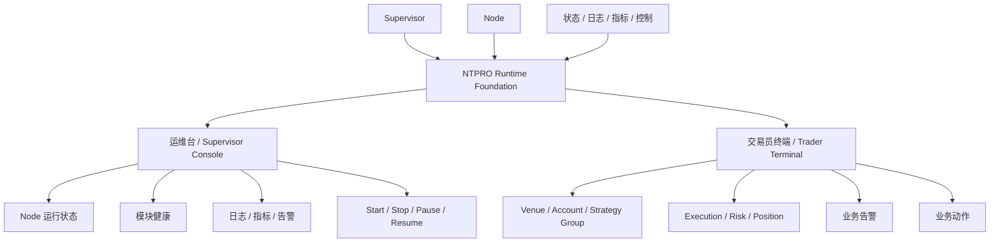

# NTPRO 控制台产品方案

Date: 2026-06-13
Executor: Codex
Status: draft product document

## 目的

本文把 NTPRO 的整体控制台产品方案写清楚。

重点不是解释底层 Rust 进程，而是定义：

- 整个产品为什么要拆成两套视角；
- 运维视角和交易员视角分别服务谁；
- `Node` 在两套产品里的角色是什么；
- 首页、详情页、状态对象、控制对象应该怎么设计；
- 当前代码已经支撑了哪一层，后续应该往哪一层扩。

本文是产品说明，不改动运行时、CLI、HTTP API 或交易语义。

## 一句话定位

```text
运维台是后端产品。
交易员终端是前端产品。
两者共用同一套 Node 运行底座。
```

再翻成白话：

```text
运维台负责看工位怎么跑。
交易员终端负责看交易怎么做。
```

## 产品总图



## 为什么必须拆成两套视角

### 运维视角关心什么

运维或策略操作者关心：

- 哪个 `Node` 在运行、暂停、停止或异常；
- 数据、执行、风控、模块哪一层出问题；
- 现在能不能 `start / stop / pause / resume`；
- 日志、指标、状态证据是否完整。

### 交易员视角关心什么

交易员关心：

- 我现在还能不能继续交易；
- 哪个 venue / 账户 / 策略组有异常；
- 执行是否正常；
- 风险是否越界；
- 仓位和暴露是否需要处理；
- 现在该停哪一套、看哪一套、盯哪一套。

### 为什么不能强行混在一个页面里

因为两类用户的主对象不一样：

- 运维主对象是 `Supervisor / Node`
- 交易员主对象是 `Venue / Account / Strategy Group / Execution / Risk / Position`

如果混成一个页面，最后通常会变成：

- 对交易员太技术；
- 对运维又不够深；
- 两边都能看，但谁都不好用。

## NTPRO 的双产品分层

## 第一层：运行底座

这是共享层。

包括：

- `Supervisor`
- `Node`
- 状态 artifacts
- 指标 artifacts
- 日志 artifacts
- lifecycle controls

这里的合同已经在仓库里明确：

- `ntpro-node` 是独立运行实例；
- `ntpro-supervisor` 负责节点注册、启动、停止、状态、日志和指标路径；
- 一个 `Node` 是一个独立交易工位。

来源：

- `docs/architecture/local_multi_node_runtime_contract.md`

## 第二层：运维台

这是后端产品。

它直接建立在共享运行底座之上。

主对象是：

- `Supervisor`
- `Node`
- `Data Source`
- `Execution Gateway`
- `Risk`
- `Runtime Modules`
- `Logs / Metrics`
- `Controls`

大白话：

```text
运维台是驾驶舱，负责知道后台工位现在怎么跑。
```

## 第三层：交易员终端

这是前端产品。

它不应该直接把 `Node` 当首页主对象，而是把 `Node` 承载的业务语义重组后给交易员看。

主对象是：

- `Venue`
- `Account`
- `Strategy Group`
- `Execution State`
- `Risk State`
- `Position / Exposure`
- `Business Alerts`

大白话：

```text
交易员终端不是看进程，而是看当前交易工作面还能不能继续运转。
```

## `Node` 在整个产品里的角色

### `Node` 的产品定义

`Node` 不应被理解成裸技术进程，而应被理解成：

```text
一个独立交易工位
```

它具备：

- 独立配置；
- 独立生命周期；
- 独立状态；
- 独立日志；
- 独立指标；
- 独立控制入口。

### `Node` 在运维台里的角色

在运维台里，`Node` 是主对象。

因为运维需要直接回答：

```text
哪个工位坏了？
坏在哪一层？
我现在能不能把它停掉、暂停或恢复？
```

### `Node` 在交易员终端里的角色

在交易员终端里，`Node` 是后台承载对象，不是首页主对象。

交易员页面里可以显示：

```text
运行工位：node-binance-mm-01
```

但不该把它作为主标题。

更合理的主对象应该是：

```text
Binance · Account A · 做市组
```

## 目标用户

面向两类本地操作者：

1. 交易员
2. 运维 / 策略操作者

### 交易员共同诉求

- 快速判断当前能不能继续交易；
- 快速定位哪个业务单元异常；
- 快速知道异常属于执行、风险、仓位还是数据问题；
- 快速止血。

### 运维共同诉求

- 快速判断系统是否健康；
- 快速定位哪个 `Node` 出问题；
- 快速判断问题属于数据、执行、风控还是运行模块；
- 在不碰底层代码的前提下，对 `Node` 做有限控制。

## 页面结构

整个产品建议保持两条主线：

```text
运维台：
1 个主页面
1 个 Node 详情页
少量辅助区域

交易员终端：
1 个终端主页面
1 个 OMS / Orders 页面
1 个 Positions & Risk 页面
少量辅助区域
```

不建议一开始拆太多导航层级。

## 运维台产品方案

### 页面 1：Supervisor Dashboard 主页面

主页面职责：

- 总览所有 `Node`；
- 展示系统级告警；
- 提供少量高频控制；
- 让用户快速进入单个 `Node` 详情。

主页面不负责：

- 展示过深的模块细节；
- 展示大量原始日志；
- 承载交易终端式复杂交互。

### 页面 2：Node Detail Panel

详情页职责：

- 展示一个 `Node` 的完整运行状态；
- 展示这个 `Node` 的数据、执行、风控和模块健康；
- 提供面向单工位的诊断和控制入口。

详情页不负责：

- 手工下单；
- 改策略参数；
- 直接改缓存、总线、内核内部对象。

## 运维台首页信息架构

### A. 顶部全局告警区

首页顶部应该先展示：

- 当前是否存在异常；
- 异常影响哪个 `Node`；
- 异常属于哪一类；
- 是否影响交易；
- 点击后进入详情。

推荐呈现：

```text
当前异常
- Binance-MM-01 执行网关异常
- OKX-Arb-02 数据源陈旧
- Sandbox-Replay-01 风控状态未知
```

这里不需要铺满历史彩条。

原因很简单：

```text
NTPRO 不是公网状态页。
用户更关心“现在哪里有问题，我怎么处理”。
```

### B. 系统总览区

这一块只给出全局摘要：

- `Node` 总数；
- 运行中数量；
- 已停止数量；
- 异常数量；
- 整体健康度；
- 最近一次状态变化；
- 最近一条全局错误摘要。

对应当前代码里的读模型字段：

- `DashboardOverview.node_count`
- `running_nodes`
- `stopped_nodes`
- `error_nodes`
- `health`
- `latest_transition_at`
- `latest_error`

来源：

- `DashboardSnapshot.overview`
- `DashboardOverview`

## `Node` 在运维台首页上的呈现

### 呈现原则

首页中的 `Node` 应以“工位摘要卡片”或“工位表格行”呈现。

每个 `Node` 只展示最重要的信息：

- `Node` 名称；
- 环境；
- venue；
- 账户别名；
- 策略组或用途；
- 生命周期状态；
- 健康度；
- 数据源状态；
- 执行网关状态；
- 风控状态；
- 最近错误；
- 可执行动作。

### 为什么 `Node` 要作为运维台首页主对象

运维实际操作时，先想到的是：

```text
哪一个交易工位不正常？
```

不是：

```text
是哪个 Rust engine enum 变了？
```

所以运维台首页主对象必须是 `Node`。

### `Node` 摘要建议字段

运维台首页每个 `Node` 建议展示：

| 字段 | 用途 | 当前代码锚点 |
| --- | --- | --- |
| `node_id` | 唯一识别这个交易工位 | `DashboardNodeSummary.node_id` |
| `lifecycle_state` | 显示 `running/paused/stopped/error` | `DashboardNodeSummary.lifecycle_state` |
| `health` | 快速判断当前是否健康 | `DashboardNodeSummary.health` |
| `last_error` | 给出一句话问题摘要 | `DashboardNodeSummary.last_error` |
| 数据源状态 | 判断数据是否正常输入 | `DataSourceStatus` |
| 执行状态 | 判断是否还能正常交易 | `ExecutionGatewayStatus` |
| 风控状态 | 判断风控是否允许交易 | `RiskStatus` |
| Controls | 执行 `start/stop/pause/resume` | `ControlStatus` |

### 运维台首页不建议主打的字段

这些字段可以保留在二级区，不建议作为首页主视觉：

- `pid`
- `config_path`
- `artifact_root`
- `stdout/stderr` 文件路径
- 原始模块名列表

原因：

它们更适合研发或深诊断，不是首页第一眼判断内容。

## 运维台 `Node` 详情页信息架构

### 详情页定位

详情页是：

```text
单个交易工位的运行面板
```

不是：

```text
手工交易终端
```

### 详情页推荐分区

#### 1. 头部概览

展示：

- `Node` 名称；
- 当前状态；
- 健康度；
- 环境；
- venue；
- 账户别名；
- 策略组；
- 最近状态变化时间；
- 主要控制按钮。

#### 2. 数据源状态

展示：

- 数据源名称；
- provider / venue；
- `connected / disconnected / stale`；
- freshness；
- lag；
- 最近错误。

对应代码字段：

- `DataSourceStatus.source_id`
- `provider`
- `connection`
- `freshness`
- `lag_ms`
- `last_error`

#### 3. 执行网关状态

展示：

- gateway 名称；
- venue；
- 连接状态；
- 是否已启动；
- open / inflight / closed 订单摘要；
- 最近错误。

对应代码字段：

- `ExecutionGatewayStatus.gateway_id`
- `venue`
- `connection`
- `started`
- `order_counts`
- `last_error`

#### 4. 风控状态

展示：

- `active / reducing / halted / unknown`；
- 健康度；
- command count；
- event count；
- 拒单总数；
- 最近拒单原因；
- 最近错误。

对应代码字段：

- `RiskStatus.trading_state`
- `health`
- `command_count`
- `event_count`
- `rejections_total`
- `last_rejection`
- `last_error`

#### 5. 系统模块状态

展示这些模块：

- `LiveNode`
- `NautilusKernel`
- `DataEngine`
- `ExecutionEngine`
- `RiskEngine`
- `Portfolio`
- `Cache`
- `MessageBus`
- `Logging`
- `Metrics writer`
- `Supervisor`

用途不是给交易员看实现细节，而是回答：

```text
这个工位内部哪个关键模块看起来不正常？
```

对应代码字段：

- `RuntimeModuleStatus.module_name`
- `status`
- `health`
- `last_seen_at`
- `last_error`

#### 6. 日志与指标

展示：

- 最近事件摘要；
- 最近错误日志；
- 核心指标摘要；
- 最近更新时间。

这部分是“证据区”，不是“全文日志浏览器”。

### 运维台详情页控制原则

详情页允许的高频动作：

- `Start`
- `Stop`
- `Pause`
- `Resume`

当前不支持或不稳定的动作，应明确展示为：

- `Disabled`
- `Not supported`

而不是显示成可点击后再神秘失败。

### 运维台详情页中的技术字段处理

以下字段应该放在折叠区或“诊断信息”区：

- `pid`
- `config_path`
- `artifact_root`
- `process_mode`
- `process_state`

原因：

它们对研发排障有价值，但不是操作者的主判断信息。

## 交易员终端产品方案

### 交易员终端的核心判断

交易员真正关心的不是：

- `node_id`
- `pid`
- `artifact_root`

而是：

- 现在这套交易桌面还能不能继续交易；
- 哪个 workspace / venue / account / strategy group 出了问题；
- 订单有没有正常发出、回报有没有正常回来；
- 风控当前是 `active`、`reducing` 还是 `halted`；
- 当前持仓、暴露、PnL 有没有进入需要处置的区间；
- 我现在应该切到订单页，还是切到持仓与风控页。

### 页面 1：Trader Terminal 主页面

主页面职责：

- 提供完整交易终端壳；
- 提供顶部全局健康状态条；
- 提供左侧稳定导航；
- 让交易员快速跳到 `OMS / Orders` 或 `Positions & Risk`；
- 先告诉用户现在能不能交易，再告诉用户异常落在哪个业务面。

主对象不是 `Node`，而是：

- `Workspace`
- `Environment`
- `Venue`
- `Account`
- `Strategy Group`

### 页面 2：OMS / Orders 页面

页面职责：

- 承接订单管理主工作流；
- 展示 `working / filled / canceled / rejected` 等状态切换；
- 支持搜索、筛选、批量查看；
- 让交易员快速定位卡单、拒单、延迟回报和异常账户。

### 页面 3：Positions & Risk 页面

页面职责：

- 承接持仓与风险主工作流；
- 展示账户、品种、策略组的仓位和暴露；
- 展示风险状态、拒单摘要、最近限制触发情况；
- 让交易员快速判断“还能不能继续做”以及“先收哪一侧风险”。

### 为什么交易员终端不能直接复用运维台首页

因为交易员看到一行：

```text
sandbox-a
```

心里还会继续问：

```text
所以这是哪个账户、哪组策略、现在哪些订单卡着、风险准不准继续做？
```

这说明它不是交易员主对象。

### 交易员终端主对象

交易员终端建议分三层主对象：

#### 第一层：终端上下文

```text
Workspace + Environment + Session
```

例如：

- `全球多策略组合 · 实盘`
- `美股套利工作区 · 盘后`

#### 第二层：业务单元

```text
Venue + Account + Strategy Group
```

例如：

- `Binance · Account A · 做市组`
- `OKX · Account B · 套利组`
- `Bybit · Account C · 趋势组`

#### 第三层：高频工作对象

- `Working Orders`
- `Rejected Orders`
- `Filled Orders`
- `Positions`
- `Risk Alerts`

### 交易员终端顶部状态条建议字段

终端顶部应稳定展示：

- `Workspace`
- `Environment`
- 盘中 / 盘后状态与会话时钟
- `Data Source` 总体状态
- `Execution Gateway` 总体状态
- `Risk Engine` 总体状态
- 活跃告警数量
- 当前用户 / 角色

大白话：

```text
交易员一进来，先看到这台交易桌面现在是不是还能干活。
```

### OMS / Orders 页面建议字段

订单页建议至少展示：

- `Order ID`
- 提交时间
- 代码 / 合约
- 买卖方向
- 委托类型
- 委托数量
- 已成数量
- 限价 / 触发价
- 成交均价
- 订单状态
- `Venue`
- `Account`
- `Strategy Group`
- 最近错误 / 最近拒单原因

### Positions & Risk 页面建议字段

持仓与风控页建议至少展示：

- `Account`
- `Instrument`
- 净持仓
- 均价
- 标记价 / 最新价
- 未实现 PnL
- 已实现 PnL
- 净暴露 / 毛暴露
- `Risk Trading State`
- `Rejections Total`
- 最近拒单原因
- 风险限制命中摘要

### 交易员终端交互原则

1. 先告诉交易员“还能不能继续交易”。
2. 主工作区必须围绕订单、成交、持仓、风险，而不是进程对象。
3. `Node` 只在诊断抽屉或跳转入口里出现，不占终端主视觉。
4. 交易员发现异常后，如需深排障，再跳到运维台。

## 运维台和交易员终端的关系

### 运维台是后台真相源

运维台直接消费：

- `Supervisor`
- `NodeStatus`
- `NodeMetrics`
- logs / metrics / alerts / controls

### 交易员终端是前台工作面

交易员终端不应该直接显示底层进程细节，而应该把运行状态重组为交易工作面。

建议关系：

```text
Node / Supervisor 状态
  -> 业务聚合层
  -> Trader Terminal 顶部状态条
  -> OMS / Orders
  -> Positions & Risk
```

### 页面跳转关系

建议支持：

- 交易员终端订单/风控异常 -> 跳转到对应 `Node Detail`
- 运维台 `Node Detail` -> 反查它承载的业务单元

这样两套视角互补，但不混淆。

## 信息架构对照

| 维度 | 运维台 | 交易员终端 |
| --- | --- | --- |
| 主对象 | `Supervisor`、`Node` | `Workspace`、`Venue`、`Account`、`Strategy Group` |
| 第一问题 | 哪个工位坏了 | 这套交易面现在还能不能继续做 |
| 首页焦点 | lifecycle、health、modules、alerts | 全局状态条、活跃告警、快速跳转 |
| 主工作区 | `Node` 列表与详情 | `OMS / Orders`、`Positions & Risk` |
| 技术字段 | 可见，但退到次级区 | 尽量隐藏，只在诊断区出现 |
| 控制对象 | `Node` lifecycle | 交易工作流与业务动作 |

## 交互原则

### 1. 先状态，后细节

首页先看健康和异常，详情页再看模块和证据。

### 2. 先业务或工位，再模块

- 运维台：先定位哪个 `Node`
- 交易员终端：先定位哪套账户 / 策略 / 订单 / 持仓出了问题

### 3. 控制动作必须可预期

按钮状态必须与当前生命周期匹配：

- 运行中才允许 `Stop`；
- 暂停中才允许 `Resume`；
- 已停止才允许 `Start`。

### 4. 两套产品边界必须稳定

```text
Supervisor Dashboard 不是交易终端。
Trader Terminal 不是进程控制台。
```

## 当前代码与未来扩展

### 当前代码已经覆盖的层

当前代码已经基本覆盖运维台底座：

- `DashboardSnapshot`
- `nodes`
- `data_sources`
- `execution_gateways`
- `risk`
- `runtime_modules`
- `logs`
- `metrics`
- `alerts`
- `controls`
- `gaps`

当前已有按 `node_id` 读取详情和控制的路由：

- `GET /api/nodes`
- `GET /api/nodes/{node_id}`
- `GET /api/nodes/{node_id}/metrics`
- `GET /api/nodes/{node_id}/logs`
- `POST /api/nodes/{node_id}/actions/start`
- `POST /api/nodes/{node_id}/actions/stop`
- `POST /api/nodes/{node_id}/actions/pause`
- `POST /api/nodes/{node_id}/actions/resume`

这意味着：

```text
运维台已经有真实数据底座。
交易员终端应该建立在这套底座之上，而不是绕开它单独造。
```

同时要明确：

```text
当前 v0.3 Dashboard MVP 还是运维控制台合同。
交易员终端是下一层产品目标，不是对现有 MVP 边界的回退。
```

### 交易员终端需要新增的聚合层

未来交易员终端至少还需要：

- `Workspace / Environment / Session` 终端上下文；
- `Venue / Account / Strategy Group` 业务聚合；
- 订单表、成交回报、拒单摘要的稳定 DTO；
- 持仓、暴露、PnL、账户健康摘要；
- `业务单元 -> Node` 的稳定映射；
- 交易动作与风险权限的独立产品合同。

## 非目标

本文明确不包含：

- 把当前 v0.3 `Supervisor Dashboard` 直接改造成交易终端；
- 在没有独立高风险合同前直接实现下单 / 改单 / 撤单；
- 策略参数热更新；
- 多用户权限系统；
- 远程多机调度控制台；
- 凭证、原始 venue payload、原始 orders/fills 的直接暴露。

## 验收口径

未来如果要按本文继续实现或重构 UI，验收标准建议是：

1. 运维台首页 10 秒内可判断整体是否健康。
2. 运维台首页 10 秒内可定位异常 `Node`。
3. 运维台详情页可区分问题属于数据、执行、风控还是模块运行。
4. 交易员终端顶部 3 秒内可判断数据源、交易网关、风控引擎是否可用。
5. `OMS / Orders` 页面 10 秒内可定位 working、rejected、filled 等关键订单状态。
6. `Positions & Risk` 页面 10 秒内可判断是否还能继续交易，以及主要风险暴露在哪里。
7. 控制动作状态与实际生命周期严格匹配。
8. 运维台不变成交易终端，交易员终端不变成进程表。
9. `Node` 只作为诊断映射对象，不占交易员终端主视觉。
10. 日志和技术路径不作为交易员终端主视觉。

## 相关文档

- `docs/architecture/dashboard_mvp_scope_contract.md`
- `docs/rust-cutover/scope/v0_3_dashboard_mvp.md`
- `docs/architecture/local_multi_node_runtime_contract.md`
- `docs/architecture/control_api_contract.md`
- `docs/architecture/observability_state_model.md`
- `docs/architecture/supervisor_dashboard_wireframes.md`
