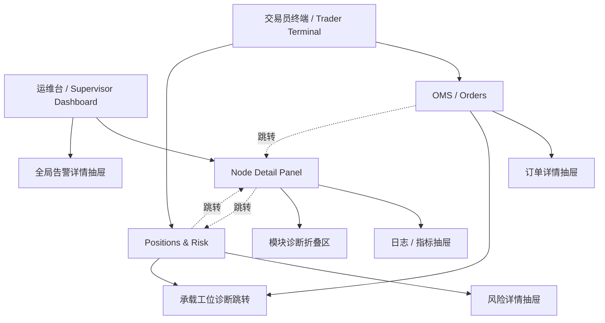

# NTPRO 控制台线框图

Date: 2026-06-13
Executor: Codex
Status: draft wireframe document

## 目的

本文给出整套 NTPRO 控制台的线框图。

包含 5 张核心页面：

1. 运维台 `Supervisor Dashboard` 主页面
2. 运维台 `Node Detail Panel`
3. 交易员终端 `Trader Terminal` 主页面
4. 交易员终端 `OMS / Orders` 页面
5. 交易员终端 `Positions & Risk` 页面

目标是帮助产品、设计和研发在同一套页面模型上对齐。

## 设计原则

先强调 6 条原则：

1. 运维台先看异常和 `Node`，不是先看技术路径。
2. 交易员终端先看订单、持仓、风险和业务上下文，后看承载 `Node`。
3. `Node` 是交易工位，不是进程条目。
4. 交易员终端是交易终端，但 `Node` 诊断不应进入主工作区。
5. 历史趋势和深诊断要收起来，不要抢主视觉。
6. 控制动作必须跟当前状态一致，不能让用户猜。

## 页面地图



## 线框图 1：运维台 Supervisor Dashboard 主页面

### 页面目标

让运维或策略操作者在 10 秒内回答：

```text
现在整体正常吗？
哪个 Node 有问题？
问题属于哪一类？
我现在能做什么？
```

### 桌面版线框图

```text
+--------------------------------------------------------------------------------------+
| NTPRO Supervisor Dashboard                                            09:41:22      |
| 本地 Supervisor · sandbox / paper / live 摘要                                        |
+--------------------------------------------------------------------------------------+
| [异常告警]                                                                           |
| 1. Binance-MM-01 执行网关异常，最近 2 分钟无 execution report              [查看详情] |
| 2. OKX-Arb-02 数据源陈旧，lag > 3000ms                                   [查看详情] |
+--------------------------------------------------------------------------------------+
| [系统总览]                                                                           |
| Node 总数 8 | 运行中 5 | 已暂停 1 | 已停止 1 | 异常 1 | 整体状态 Degraded             |
| 最近变化 09:40:11 | 最近错误 Binance-MM-01 execution gateway timeout                 |
+--------------------------------------------------------------------------------------+
| [Node 列表]                                                                          |
|--------------------------------------------------------------------------------------|
| Node              | 状态    | 数据源   | 执行网关 | 风控   | 最近错误        | 动作       |
|--------------------------------------------------------------------------------------|
| Binance-MM-01     | Running | Healthy  | Error    | Active | exec timeout    | 停止 详情  |
| OKX-Arb-02        | Running | Stale    | Healthy  | Active | lag high        | 暂停 详情  |
| Bybit-Trend-01    | Paused  | Healthy  | Healthy  | Active | none            | 恢复 详情  |
| Replay-Sandbox-01 | Stopped | Unknown  | Unknown  | Unknown| none            | 启动 详情  |
| ...                                                                                  |
+--------------------------------------------------------------------------------------+
| [说明]                                                                               |
| 数据源 / 执行 / 风控 只显示摘要状态；更深的模块状态进入 Node 详情页查看。            |
+--------------------------------------------------------------------------------------+
```

### 页面布局解释

#### 顶部告警区

放最重要的异常，不放大面积 uptime 条。

原因：

```text
本地控制台更关心“现在什么坏了”，
而不是像公网状态页那样强调长时间可用率历史。
```

#### 系统总览区

只放全局摘要数字和一句话错误，不堆技术字段。

#### Node 列表区

这是运维台首页核心。每一行代表一个交易工位。

每行建议只展示 7 类信息：

1. `Node` 名称
2. 生命周期状态
3. 数据源状态
4. 执行网关状态
5. 风控状态
6. 最近错误
7. 动作

## 运维台首页移动版线框图

```text
+--------------------------------------+
| NTPRO Dashboard                      |
+--------------------------------------+
| 异常 2                               |
| Binance-MM-01 执行异常      [详情]   |
| OKX-Arb-02 数据陈旧         [详情]   |
+--------------------------------------+
| 总览                                 |
| Node 8 / 运行 5 / 异常 1             |
| 最近变化 09:40:11                    |
+--------------------------------------+
| Binance-MM-01                        |
| Running · Binance · 账户 A           |
| Data Healthy | Exec Error | Risk OK  |
| exec timeout                         |
| [停止] [详情]                        |
+--------------------------------------+
| OKX-Arb-02                           |
| Running · OKX · 账户 B               |
| Data Stale | Exec Healthy | Risk OK  |
| lag high                             |
| [暂停] [详情]                        |
+--------------------------------------+
```

## 线框图 2：运维台 Node Detail Panel

### 页面目标

让运维回答：

```text
这个交易工位现在到底怎么了？
问题在数据、执行、风控还是运行模块？
我能不能现在处理？
```

### 桌面版线框图

```text
+--------------------------------------------------------------------------------------+
| Node Detail: Binance-MM-01                                            [返回列表]    |
| Running · Health: Degraded · Binance · Account A · 做市组                            |
| 最近状态变化 09:40:11                                             [停止] [暂停]     |
+--------------------------------------------------------------------------------------+
| [摘要卡片]                                                                          |
| 数据源 Error / 执行网关 Error / 风控 Active / 模块 Degraded                          |
+--------------------------------------------------------------------------------------+
| [数据源状态]                                  | [执行网关状态]                        |
| Source: Binance:data                          | Gateway: Binance:gateway              |
| Connection: Connected                         | Connection: Connected                 |
| Freshness: stale                              | Started: true                         |
| Lag: 3520ms                                   | Orders: open 12 / inflight 1 / closed |
| Last error: lag above threshold               | Last error: execution timeout         |
+--------------------------------------------------------------------------------------+
| [风控状态]                                    | [系统模块状态]                        |
| Trading state: Active                         | LiveNode          Healthy             |
| Health: Healthy                               | NautilusKernel    Healthy             |
| Rejections total: 2                           | DataEngine        Healthy             |
| Last rejection: order size exceeded           | ExecutionEngine   Error               |
| Last error: none                              | RiskEngine        Healthy             |
|                                               | Portfolio         Healthy             |
|                                               | Cache             Healthy             |
|                                               | MessageBus        Healthy             |
|                                               | Logging           Healthy             |
|                                               | Metrics writer    Healthy             |
|                                               | Supervisor        Healthy             |
+--------------------------------------------------------------------------------------+
| [最近事件 / 告警]                                                                     |
| 09:40:11 execution gateway timeout                                                   |
| 09:39:55 reconnect_execution not supported                                           |
| 09:38:02 data lag crossed threshold                                                  |
+--------------------------------------------------------------------------------------+
| [日志 / 指标]                                                                         |
| starts_total=1  stops_total=0  uptime_ms=123000  transitions=3                       |
| stdout/stderr/events 入口                                                     [展开] |
+--------------------------------------------------------------------------------------+
| [诊断信息（折叠）]                                                                    |
| process_state / pid / config_path / artifact_root / process_mode                     |
+--------------------------------------------------------------------------------------+
```

### 页面分区解释

#### 头部

头部只保留“这个工位是谁、现在什么状态、我能做什么”。

#### 摘要卡片

让用户先看到：

- 数据
- 执行
- 风控
- 模块

四个维度是否有明显异常。

#### 数据源与执行并排

这是最容易影响“还能不能继续跑”的两块，适合并排放。

#### 风控与模块状态并排

风控负责回答“准不准继续交易”，模块状态负责回答“内部哪一层不对劲”。

#### 日志 / 指标放底部

它们是证据，不该盖过判断主线。

## 运维台详情页移动版线框图

```text
+--------------------------------------+
| Binance-MM-01                        |
| Running · Degraded                   |
| Binance · Account A · 做市组         |
| [停止] [暂停]                        |
+--------------------------------------+
| 摘要                                 |
| 数据 Error                           |
| 执行 Error                           |
| 风控 Active                          |
| 模块 Degraded                        |
+--------------------------------------+
| 数据源状态                           |
| Connected                            |
| stale · 3520ms                       |
| lag above threshold                  |
+--------------------------------------+
| 执行网关状态                         |
| Connected · started                  |
| open 12 / inflight 1                 |
| execution timeout                    |
+--------------------------------------+
| 风控状态                             |
| Active                               |
| Reject 2                             |
| order size exceeded                  |
+--------------------------------------+
| 模块状态                             |
| ExecutionEngine Error                |
| LiveNode Healthy                     |
| RiskEngine Healthy                   |
| ...                                  |
+--------------------------------------+
| 最近事件 / 日志 / 指标               |
+--------------------------------------+
```

## 线框图 3：交易员终端 Trader Terminal 主页面

### 页面目标

让交易员在 3 到 10 秒内回答：

```text
现在这张交易桌面还能不能继续工作？
是数据、交易网关还是风控先出了问题？
我要先进订单页，还是先看持仓与风险？
```

### 桌面版线框图

```text
+--------------------------------------------------------------------------------------+
| NTPRO Trader Terminal | 工作空间: 全球多策略组合 | 环境: 实盘 | 盘中交易 (剩余 03:45:12) |
| 数据源 ● 正常 | 交易网关 ● 4ms | 风控引擎 ● 正常 | 告警 2 | J. Doe                 |
+--------------------------------------------------------------------------------------+
| 总览 | 订单管理 | 成交回报 | 持仓与风险 | 告警中心 | 日志/诊断                             |
+--------------------------------------------------------------------------------------+
| [顶部告警] Binance 做市组 reject spike，最近 2 分钟 4 次拒单       [进入订单页] [进入风险页] |
+--------------------------------------------------------------------------------------+
| [交易桌面摘要]        | [订单摘要]                   | [持仓 / 风险摘要]        | [关注列表] |
| 可交易业务 4          | Working 128                  | Open positions 23        | Binance A  |
| 观察中 1              | Rejected 4                   | Gross exposure 12.4M     | OKX B      |
| 降档 1                | Filled today 2,341           | Risk state Active        | Bybit C    |
| 主要异常 做市组       | Last gateway error 09:40     | Last rejection 09:39     | ...        |
+--------------------------------------------------------------------------------------+
| [快速入口] 订单管理 | 持仓与风险 | 告警中心 | 承载工位诊断                                      |
+--------------------------------------------------------------------------------------+
```

### 页面布局解释

#### 顶部状态条

先让交易员看到：

- 当前工作空间；
- 当前环境；
- 当前交易时段；
- 数据源 / 交易网关 / 风控引擎是不是还活着；
- 当前是否有高优先级告警。

#### 左侧稳定导航

交易员终端需要稳定导航，而不是单页看板。建议保留：

- 总览
- 订单管理
- 成交回报
- 持仓与风险
- 告警中心
- 日志/诊断

#### 中部快速摘要

主页面不是为了替代订单页和持仓页，而是为了：

- 给出全局可交易判断；
- 给出当前最值得优先处理的问题；
- 让用户一跳进入正确工作区。

### 终端形态说明

大白话：

```text
这不是“业务列表页”，而是一张真正的交易桌面壳。
```

## 线框图 4：交易员终端 OMS / Orders 页面

### 页面目标

让交易员回答：

```text
订单现在有没有正常出去？
哪些单在 working，哪些单被 reject，哪些单已经成了？
异常集中在哪个账户、策略组、品种或 venue？
```

### 桌面版线框图

```text
+--------------------------------------------------------------------------------------+
| NTPRO Trader Terminal | 订单管理 / OMS | 工作空间: 全球多策略组合 | 环境: 实盘        |
| 数据源 ● 正常 | 交易网关 ● 4ms | 风控引擎 ● 正常 | 告警 2                           |
+----------------------+-----------------------------------------------------------------------+
| 总览                 | [状态切换] 全部 | 执行中 | 已成交 | 已撤销 | 拒单                          |
| 订单管理             | [搜索订单号/代码/账户]                    [筛选] [批量撤单*]          |
| 成交回报             |-----------------------------------------------------------------------|
| 持仓与风险           | 订单号   时间      代码    方向  类型   委托数量 已成数量 状态     账户 |
| 告警中心             |-----------------------------------------------------------------------|
| 日志/诊断            | ORD-99000 10:52:08 ETHUSD SELL MARKET 1580 0    已拒单   EQ_MAIN     |
|                      | ORD-99001 11:42:18 MSFT   BUY  LIMIT  4360 4360 已成交   FUT_HEDGE   |
|                      | ORD-99002 11:24:29 AMZN   BUY  LIMIT  5210 4368 部分成交 FX_CARRY    |
|                      | ORD-99003 09:38:48 ETHUSD BUY  LIMIT  8400 8400 已成交   ARB_01      |
|                      | ORD-99004 13:54:26 TSLA   BUY  LIMIT  6870 0    已拒单   FX_CARRY    |
|                      | ...                                                                   |
+--------------------------------------------------------------------------------------+
| * 批量撤单 / 改单 / 下单类动作属于未来交易终端能力，需要独立高风险合同。             |
+--------------------------------------------------------------------------------------+
```

### 页面分区解释

#### 状态切换区

交易员最常用的是：

- `All`
- `Working`
- `Filled`
- `Canceled`
- `Rejected`

这些应该固定在表格上方，切换成本要低。

#### 搜索和筛选区

搜索和筛选不是附属功能，而是 OMS 主工作流。

至少要能按这些维度筛：

- 订单号
- 代码 / 合约
- `Venue`
- `Account`
- `Strategy Group`
- 订单状态

#### 订单表

订单表应该是页面主视觉，密度要高、扫描路径要短。

一眼先看：

- 状态
- 方向
- 数量
- 已成
- 账户
- 最近异常

### 终端边界说明

这个页面的形态可以是交易终端，但当前 v0.3 `Supervisor Dashboard` 合同并不提供：

- 下单；
- 改单；
- 撤单；
- 原始 orders/fills 暴露。

所以这里定义的是**前台产品目标**，不是当前控制台 MVP 的现状声明。

## 线框图 5：交易员终端 Positions & Risk 页面

### 页面目标

让交易员回答：

```text
当前还能不能继续做？
主要风险暴露在哪些账户、品种、策略组？
是仓位问题，还是风控已经开始降档/停机？
```

### 桌面版线框图

```text
+--------------------------------------------------------------------------------------+
| NTPRO Trader Terminal | 持仓与风险 | 工作空间: 全球多策略组合 | 环境: 实盘            |
| 数据源 ● 正常 | 交易网关 ● 4ms | 风控引擎 ● Degraded | 告警 2                        |
+--------------------------------------------------------------------------------------+
| [顶部摘要] 可交易: 否 | Risk State: Reducing | Gross Exposure: 12.4M | uPnL: +24300       |
+---------------------------------------------+----------------------------------------+
| [持仓表]                                     | [风险面板]                             |
| 账户   品种    净持仓  均价    标记价  uPnL   | Trading state: Reducing                |
| EQ_A   BTCUSD  +12     42100   42220   +1440 | Rejections total: 4                    |
| EQ_A   ETHUSD  -18     3020    3008    +216  | Last rejection: price band exceeded    |
| FX_B   EURUSD  +4.2M   1.0842  1.0838  -1680 | Limit hit: order rate threshold        |
| FUT_C  NQZ4    -9      18942   18980   -342  | Affected strategy: Binance 做市组      |
| ...                                          | [查看告警] [进入承载工位]              |
+---------------------------------------------+----------------------------------------+
| [暴露与账户健康]                                                                     |
| 毛暴露 / 净暴露 / 保证金健康 / 缺失定价数量 / 最近快照时间                           |
+--------------------------------------------------------------------------------------+
```

### 页面分区解释

#### 顶部摘要带

先给结论，不先给明细。

交易员第一眼应该看到：

- 还能不能继续做；
- 风控当前是 `active`、`reducing` 还是 `halted`；
- 暴露量级是否过大；
- 当前 PnL 是否异常。

#### 持仓表

持仓表回答：

```text
风险到底压在哪些品种、哪些账户、哪些策略上。
```

#### 风险面板

风险面板回答：

```text
系统是不是已经开始拒单、限流、降档，最近一次为什么拦。
```

#### 承载工位入口

这里不是主视觉，只保留一个诊断入口：

```text
如果要深排障，再去看 Node Detail。
```

## 两套产品的视觉优先级

### 运维台首页优先级

1. 当前异常
2. `Node` 列表
3. 系统总览
4. 深层模块或日志入口

### 运维台详情页优先级

1. `Node` 当前状态与动作
2. 数据 / 执行 / 风控摘要
3. 模块状态
4. 事件 / 日志 / 指标
5. 技术诊断字段

### 交易员终端主页面优先级

1. 数据源 / 交易网关 / 风控引擎的全局健康条
2. 高优先级告警
3. 快速跳到订单页或持仓页
4. 关键业务摘要

### OMS / Orders 页面优先级

1. 状态切换与筛选
2. 订单表
3. 最近异常
4. 诊断跳转

### Positions & Risk 页面优先级

1. 能不能继续交易
2. 风控状态
3. 主要暴露
4. 持仓明细
5. 诊断跳转

## 当前代码字段落点

### 已能直接映射到运维台的字段

- `DashboardSnapshot.overview`
- `DashboardSnapshot.nodes`
- `DashboardSnapshot.data_sources`
- `DashboardSnapshot.execution_gateways`
- `DashboardSnapshot.risk`
- `DashboardSnapshot.runtime_modules`
- `DashboardSnapshot.logs`
- `DashboardSnapshot.metrics`
- `DashboardSnapshot.alerts`
- `DashboardSnapshot.controls`

对应 API 路由：

- `GET /api/snapshot`
- `GET /api/nodes`
- `GET /api/nodes/{node_id}`
- `GET /api/nodes/{node_id}/metrics`
- `GET /api/nodes/{node_id}/logs`
- `POST /api/nodes/{node_id}/actions/*`

### 已能部分支撑交易员终端顶部状态条的字段

- `DashboardSnapshot.data_sources`
- `DashboardSnapshot.execution_gateways`
- `DashboardSnapshot.risk`
- `DashboardSnapshot.alerts`

它们足够支撑：

- 数据源健康点；
- 交易网关健康点；
- 风控健康点；
- 顶部活跃告警摘要。

### 交易员终端未来需要的业务聚合层

交易员终端线框图已经定义清楚，但当前代码还需要补一层业务聚合：

- `Workspace / Environment / Session` 终端上下文；
- 订单表与成交回报 DTO；
- 持仓、暴露、PnL、账户健康 DTO；
- 风险限制命中和最近拒单摘要；
- 业务单元到 `Node` 的稳定映射；
- 交易动作与权限的独立产品合同。

## 非目标

这份线框图不代表当前立刻实现：

- 把 `Supervisor Dashboard` 直接变成交易终端；
- 在没有合同前直接开放下单 / 改单 / 撤单；
- 多用户权限流；
- 分布式多机控制页；
- 策略配置编辑器；
- 凭证和原始 payload 直接展示。

## 相关文档

- `docs/architecture/supervisor_dashboard_product_spec.md`
- `docs/architecture/dashboard_mvp_scope_contract.md`
- `docs/rust-cutover/scope/v0_3_dashboard_mvp.md`
