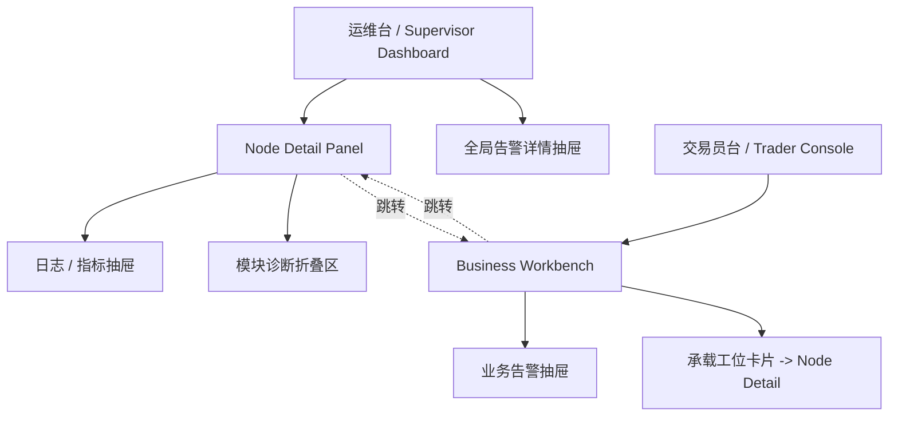

# NTPRO 控制台线框图

Date: 2026-06-13
Executor: Codex
Status: draft wireframe document

## 目的

本文给出整套 NTPRO 控制台的线框图。

包含 4 张核心页面：

1. 运维台 `Supervisor Dashboard` 主页面
2. 运维台 `Node Detail Panel`
3. 交易员台 `Trader Console` 主页面
4. 交易员台 `Business Workbench`

目标是帮助产品、设计和研发在同一套页面模型上对齐。

## 设计原则

先强调 6 条原则：

1. 运维台先看异常和 `Node`，不是先看技术路径。
2. 交易员台先看业务单元，后看承载 `Node`。
3. `Node` 是交易工位，不是进程条目。
4. 交易员台不是交易终端，不做手工下单。
5. 历史趋势和深诊断要收起来，不要抢主视觉。
6. 控制动作必须跟当前状态一致，不能让用户猜。

## 页面地图



## 线框图 1：运维台 Supervisor Dashboard 主页面

### 页面目标

让运维或策略操作者在 10 秒内回答：

```text
现在整体正常吗？
哪个 Node 有问题？
问题属于哪一类？
我现在能做什么？
```

### 桌面版线框图

```text
+--------------------------------------------------------------------------------------+
| NTPRO Supervisor Dashboard                                            09:41:22      |
| 本地 Supervisor · sandbox / paper / live 摘要                                        |
+--------------------------------------------------------------------------------------+
| [异常告警]                                                                           |
| 1. Binance-MM-01 执行网关异常，最近 2 分钟无 execution report              [查看详情] |
| 2. OKX-Arb-02 数据源陈旧，lag > 3000ms                                   [查看详情] |
+--------------------------------------------------------------------------------------+
| [系统总览]                                                                           |
| Node 总数 8 | 运行中 5 | 已暂停 1 | 已停止 1 | 异常 1 | 整体状态 Degraded             |
| 最近变化 09:40:11 | 最近错误 Binance-MM-01 execution gateway timeout                 |
+--------------------------------------------------------------------------------------+
| [Node 列表]                                                                          |
|--------------------------------------------------------------------------------------|
| Node              | 状态    | 数据源   | 执行网关 | 风控   | 最近错误        | 动作       |
|--------------------------------------------------------------------------------------|
| Binance-MM-01     | Running | Healthy  | Error    | Active | exec timeout    | 停止 详情  |
| OKX-Arb-02        | Running | Stale    | Healthy  | Active | lag high        | 暂停 详情  |
| Bybit-Trend-01    | Paused  | Healthy  | Healthy  | Active | none            | 恢复 详情  |
| Replay-Sandbox-01 | Stopped | Unknown  | Unknown  | Unknown| none            | 启动 详情  |
| ...                                                                                  |
+--------------------------------------------------------------------------------------+
| [说明]                                                                               |
| 数据源 / 执行 / 风控 只显示摘要状态；更深的模块状态进入 Node 详情页查看。            |
+--------------------------------------------------------------------------------------+
```

### 页面布局解释

#### 顶部告警区

放最重要的异常，不放大面积 uptime 条。

原因：

```text
本地控制台更关心“现在什么坏了”，
而不是像公网状态页那样强调长时间可用率历史。
```

#### 系统总览区

只放全局摘要数字和一句话错误，不堆技术字段。

#### Node 列表区

这是运维台首页核心。每一行代表一个交易工位。

每行建议只展示 7 类信息：

1. `Node` 名称
2. 生命周期状态
3. 数据源状态
4. 执行网关状态
5. 风控状态
6. 最近错误
7. 动作

## 运维台首页移动版线框图

```text
+--------------------------------------+
| NTPRO Dashboard                      |
+--------------------------------------+
| 异常 2                               |
| Binance-MM-01 执行异常      [详情]   |
| OKX-Arb-02 数据陈旧         [详情]   |
+--------------------------------------+
| 总览                                 |
| Node 8 / 运行 5 / 异常 1             |
| 最近变化 09:40:11                    |
+--------------------------------------+
| Binance-MM-01                        |
| Running · Binance · 账户 A           |
| Data Healthy | Exec Error | Risk OK  |
| exec timeout                         |
| [停止] [详情]                        |
+--------------------------------------+
| OKX-Arb-02                           |
| Running · OKX · 账户 B               |
| Data Stale | Exec Healthy | Risk OK  |
| lag high                             |
| [暂停] [详情]                        |
+--------------------------------------+
```

## 线框图 2：运维台 Node Detail Panel

### 页面目标

让运维回答：

```text
这个交易工位现在到底怎么了？
问题在数据、执行、风控还是运行模块？
我能不能现在处理？
```

### 桌面版线框图

```text
+--------------------------------------------------------------------------------------+
| Node Detail: Binance-MM-01                                            [返回列表]    |
| Running · Health: Degraded · Binance · Account A · 做市组                            |
| 最近状态变化 09:40:11                                             [停止] [暂停]     |
+--------------------------------------------------------------------------------------+
| [摘要卡片]                                                                          |
| 数据源 Error / 执行网关 Error / 风控 Active / 模块 Degraded                          |
+--------------------------------------------------------------------------------------+
| [数据源状态]                                  | [执行网关状态]                        |
| Source: Binance:data                          | Gateway: Binance:gateway              |
| Connection: Connected                         | Connection: Connected                 |
| Freshness: stale                              | Started: true                         |
| Lag: 3520ms                                   | Orders: open 12 / inflight 1 / closed |
| Last error: lag above threshold               | Last error: execution timeout         |
+--------------------------------------------------------------------------------------+
| [风控状态]                                    | [系统模块状态]                        |
| Trading state: Active                         | LiveNode          Healthy             |
| Health: Healthy                               | NautilusKernel    Healthy             |
| Rejections total: 2                           | DataEngine        Healthy             |
| Last rejection: order size exceeded           | ExecutionEngine   Error               |
| Last error: none                              | RiskEngine        Healthy             |
|                                               | Portfolio         Healthy             |
|                                               | Cache             Healthy             |
|                                               | MessageBus        Healthy             |
|                                               | Logging           Healthy             |
|                                               | Metrics writer    Healthy             |
|                                               | Supervisor        Healthy             |
+--------------------------------------------------------------------------------------+
| [最近事件 / 告警]                                                                     |
| 09:40:11 execution gateway timeout                                                   |
| 09:39:55 reconnect_execution not supported                                           |
| 09:38:02 data lag crossed threshold                                                  |
+--------------------------------------------------------------------------------------+
| [日志 / 指标]                                                                         |
| starts_total=1  stops_total=0  uptime_ms=123000  transitions=3                       |
| stdout/stderr/events 入口                                                     [展开] |
+--------------------------------------------------------------------------------------+
| [诊断信息（折叠）]                                                                    |
| process_state / pid / config_path / artifact_root / process_mode                     |
+--------------------------------------------------------------------------------------+
```

### 页面分区解释

#### 头部

头部只保留“这个工位是谁、现在什么状态、我能做什么”。

#### 摘要卡片

让用户先看到：

- 数据
- 执行
- 风控
- 模块

四个维度是否有明显异常。

#### 数据源与执行并排

这是最容易影响“还能不能继续跑”的两块，适合并排放。

#### 风控与模块状态并排

风控负责回答“准不准继续交易”，模块状态负责回答“内部哪一层不对劲”。

#### 日志 / 指标放底部

它们是证据，不该盖过判断主线。

## 运维台详情页移动版线框图

```text
+--------------------------------------+
| Binance-MM-01                        |
| Running · Degraded                   |
| Binance · Account A · 做市组         |
| [停止] [暂停]                        |
+--------------------------------------+
| 摘要                                 |
| 数据 Error                           |
| 执行 Error                           |
| 风控 Active                          |
| 模块 Degraded                        |
+--------------------------------------+
| 数据源状态                           |
| Connected                            |
| stale · 3520ms                       |
| lag above threshold                  |
+--------------------------------------+
| 执行网关状态                         |
| Connected · started                  |
| open 12 / inflight 1                 |
| execution timeout                    |
+--------------------------------------+
| 风控状态                             |
| Active                               |
| Reject 2                             |
| order size exceeded                  |
+--------------------------------------+
| 模块状态                             |
| ExecutionEngine Error                |
| LiveNode Healthy                     |
| RiskEngine Healthy                   |
| ...                                  |
+--------------------------------------+
| 最近事件 / 日志 / 指标               |
+--------------------------------------+
```

## 线框图 3：交易员台 Trader Console 主页面

### 页面目标

让交易员在 10 秒内回答：

```text
我现在还能不能交易？
哪套业务单元出了问题？
问题属于执行、风控、仓位还是数据？
我应该先处理哪一套？
```

### 主对象定义

交易员台主对象不是 `Node`，而是：

```text
Venue + Account + Strategy Group
```

例如：

- `Binance · Account A · 做市组`
- `OKX · Account B · 套利组`
- `Bybit · Account C · 趋势组`

### 桌面版线框图

```text
+--------------------------------------------------------------------------------------+
| NTPRO Trader Console                                                 09:41:22       |
| 实盘业务总览 · 本地运行底座正常 · 交易员视角                                        |
+--------------------------------------------------------------------------------------+
| [业务告警]                                                                           |
| 1. Binance · Account A · 做市组 执行异常，最近 2 分钟有 4 次 reject       [查看详情] |
| 2. OKX · Account B · 套利组 风险降档，已进入 reducing                    [查看详情] |
+--------------------------------------------------------------------------------------+
| [业务总览]                                                                           |
| 业务单元 6 | 可交易 4 | 观察中 1 | 降档 1 | 停止 0 | 总体风险 Degraded                |
| 最近变化 09:40:11 | 主要问题 Binance 做市组 execution reject spike                 |
+--------------------------------------------------------------------------------------+
| [业务单元列表]                                                                      |
|--------------------------------------------------------------------------------------|
| Venue / Account / 策略组 | 交易状态 | 执行 | 风控 | 持仓/暴露 | 最近告警 | 工位 |
|--------------------------------------------------------------------------------------|
| Binance / A / 做市组     | 可交易   | 异常 | 正常 | BTC +12   | reject ↑  | MM-01 |
| OKX / B / 套利组         | 降档中   | 正常 | Reducing | ETH +/- | risk hold | ARB-02 |
| Bybit / C / 趋势组       | 观察中   | 正常 | 正常 | SOL +3    | none      | TR-01 |
| Sandbox / Demo / 回放组  | 已停止   | 无   | 无   | 0          | none      | RP-01 |
+--------------------------------------------------------------------------------------+
| [说明]                                                                               |
| 交易员台先看业务单元；如需排障，可进入业务详情页，再跳转到承载工位。                |
+--------------------------------------------------------------------------------------+
```

### 页面布局解释

#### 业务告警区

顶部直接说：

- 哪个业务单元异常；
- 异常属于执行、风险还是仓位；
- 是否影响继续交易。

#### 业务总览区

这里只放交易员能立即理解的聚合状态：

- 可交易数量
- 观察中数量
- 降档数量
- 停止数量
- 总体风险

#### 业务单元列表区

这是交易员台首页核心。每一行代表一套业务单元。

每行建议只展示：

1. `Venue / Account / Strategy Group`
2. 交易状态
3. 执行状态
4. 风控状态
5. 持仓 / 暴露摘要
6. 最近告警
7. 承载工位

## 交易员台首页移动版线框图

```text
+--------------------------------------+
| Trader Console                       |
+--------------------------------------+
| 告警 2                               |
| Binance 做市组 执行异常     [详情]   |
| OKX 套利组 风险降档         [详情]   |
+--------------------------------------+
| 总览                                 |
| 业务 6 / 可交易 4 / 降档 1           |
| 最近变化 09:40:11                    |
+--------------------------------------+
| Binance · Account A                  |
| 做市组 · 可交易                      |
| 执行异常 | 风控正常 | BTC +12        |
| reject spike                         |
| [详情]                               |
+--------------------------------------+
| OKX · Account B                      |
| 套利组 · 降档中                      |
| 执行正常 | Reducing | ETH +/-        |
| risk hold                            |
| [详情]                               |
+--------------------------------------+
```

## 线框图 4：交易员台 Business Workbench

### 页面目标

让交易员回答：

```text
这套业务单元现在还能不能继续交易？
问题在执行、风险还是持仓？
背后是哪一个工位在承载？
如果有异常，我应该先看哪里？
```

### 桌面版线框图

```text
+--------------------------------------------------------------------------------------+
| Business Workbench: Binance · Account A · 做市组                      [返回列表]    |
| 可交易 · 执行异常 · 风控正常 · 主要暴露 BTC +12                                      |
| 最近变化 09:40:11                                                    [查看工位]      |
+--------------------------------------------------------------------------------------+
| [业务摘要卡片]                                                                        |
| Execution Error / Risk Active / Position Elevated / Data Healthy                      |
+--------------------------------------------------------------------------------------+
| [执行状态]                                    | [风险状态]                            |
| Gateway: Binance                              | Trading state: Active                 |
| Connection: Connected                         | Rejections total: 4                   |
| Open: 12 / Inflight: 1 / Rejected: 4         | Last rejection: price band exceeded   |
| Last error: execution timeout                 | Last error: none                      |
+--------------------------------------------------------------------------------------+
| [持仓 / 暴露]                                 | [业务告警]                            |
| BTCUSD net: +12                               | 09:40:11 reject spike                 |
| ETHUSD net: 0                                 | 09:39:55 order retry timeout          |
| Local PnL: +24,300                            | 09:38:02 execution report delayed     |
| Margin health: normal                         |                                        |
+--------------------------------------------------------------------------------------+
| [承载工位]                                                                          |
| Node: Binance-MM-01 · Running · Degraded · 执行网关异常                    [进入工位] |
+--------------------------------------------------------------------------------------+
| [业务事件 / 摘要日志]                                                                 |
| 最近 20 条业务相关事件摘要                                                           |
+--------------------------------------------------------------------------------------+
```

### 页面分区解释

#### 头部

头部必须先说清楚：

- 这是哪套业务单元；
- 能不能继续交易；
- 当前主要问题是什么；
- 它由哪个工位承载。

#### 执行状态

这是交易员台最重要的区块之一。

它回答：

```text
订单有没有正常出去、回报有没有回来、有没有 reject 或卡住。
```

#### 风险状态

这块回答：

```text
系统现在准不准继续做这套业务。
```

#### 持仓 / 暴露

这块回答：

```text
即使系统还在跑，当前暴露是不是已经需要关注。
```

#### 承载工位

这一块是交易员台和运维台的连接点。

只有当交易员需要深排障时，才进入 `Node Detail`。

## 交易员台详情页移动版线框图

```text
+--------------------------------------+
| Binance · Account A                  |
| 做市组 · 可交易                      |
| BTC +12 · 执行异常                   |
| [查看工位]                           |
+--------------------------------------+
| 摘要                                 |
| Execution Error                      |
| Risk Active                          |
| Position Elevated                    |
| Data Healthy                         |
+--------------------------------------+
| 执行状态                             |
| Open 12 / Inflight 1 / Reject 4      |
| execution timeout                    |
+--------------------------------------+
| 风险状态                             |
| Active                               |
| price band exceeded                  |
+--------------------------------------+
| 持仓 / 暴露                          |
| BTC +12                              |
| Local PnL +24,300                    |
+--------------------------------------+
| 承载工位                             |
| Binance-MM-01 · Running              |
| [进入工位]                           |
+--------------------------------------+
```

## 两套产品的视觉优先级

### 运维台首页优先级

1. 当前异常
2. `Node` 列表
3. 系统总览
4. 深层模块或日志入口

### 运维台详情页优先级

1. `Node` 当前状态与动作
2. 数据 / 执行 / 风控摘要
3. 模块状态
4. 事件 / 日志 / 指标
5. 技术诊断字段

### 交易员台首页优先级

1. 哪套业务单元异常
2. 能不能继续交易
3. 执行 / 风控 / 暴露摘要
4. 承载工位映射

### 交易员台详情页优先级

1. 业务状态
2. 执行
3. 风控
4. 持仓 / 暴露
5. 业务告警
6. 承载工位

## 当前代码字段落点

### 已能直接映射到运维台的字段

- `DashboardSnapshot.overview`
- `DashboardSnapshot.nodes`
- `DashboardSnapshot.data_sources`
- `DashboardSnapshot.execution_gateways`
- `DashboardSnapshot.risk`
- `DashboardSnapshot.runtime_modules`
- `DashboardSnapshot.logs`
- `DashboardSnapshot.metrics`
- `DashboardSnapshot.alerts`
- `DashboardSnapshot.controls`

对应 API 路由：

- `GET /api/snapshot`
- `GET /api/nodes`
- `GET /api/nodes/{node_id}`
- `GET /api/nodes/{node_id}/metrics`
- `GET /api/nodes/{node_id}/logs`
- `POST /api/nodes/{node_id}/actions/*`

### 交易员台未来需要的业务聚合层

交易员台线框图已经定义清楚，但当前代码还需要补一层业务聚合：

- `Venue / Account / Strategy Group` 分组摘要；
- 业务级 execution summary；
- 业务级 risk summary；
- 持仓 / 暴露 / 账户健康摘要；
- 业务单元到 `Node` 的稳定映射。

## 非目标

这份线框图不包含：

- 手工下单面板；
- 盘口或成交明细终端；
- 多用户权限流；
- 分布式多机控制页；
- 策略配置编辑器。

## 相关文档

- `docs/architecture/supervisor_dashboard_product_spec.md`
- `docs/architecture/dashboard_mvp_scope_contract.md`
- `docs/rust-cutover/scope/v0_3_dashboard_mvp.md`
