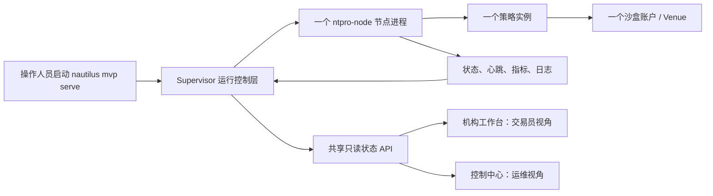
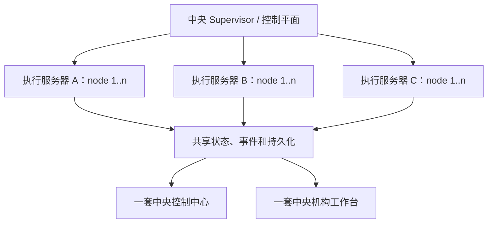

# NTPRO 系统运行与运营操作说明书

Date: 2026-08-26
Executor: Codex
Status: 当前单节点 MVP 使用手册

## 1. 先用一句话理解 NTPRO

NTPRO 当前是一套**本机运行的机构交易系统演示基线**：Supervisor 负责启动和管理一个
沙盒节点，节点运行一个策略实例；控制中心给运维看技术状态，机构工作台给交易员看业务
状态。

它已经能把“策略是谁、运行在哪、现在是否健康、发生了什么”串起来，但**不能连接真实
交易所，也不能提交真实订单**。

## 2. 这份说明书给谁看

- **交易员、研究员、投资组合负责人**：主要使用机构工作台，判断策略和账户发生了什么；
- **平台管理员、技术运维、风控值班人员**：主要使用控制中心，判断节点为什么是这个状态；
- **产品负责人和首次接触项目的人**：通过本文理解系统边界、运行流程和后续演进方向。

不要求读者先懂 Rust、Axum、进程管理或交易引擎。

## 3. 当前系统全景



当前冻结拓扑严格是：

| 对象 | 数量 | 当前含义 |
| --- | ---: | --- |
| Supervisor | 1 | 本地运行控制层，同时提供门户和 API |
| `ntpro-node` | 1 | 被 Supervisor 启动和停止的本地节点进程 |
| 策略实例 | 1 | 运行在节点中的策略业务实例 |
| 账户 | 1 | 沙盒账户，不是真实资金账户 |
| Venue | 1 | 沙盒 Venue，不连接外部交易所 |
| 机构工作台 | 1 | 面向交易员的只读业务页面 |
| 控制中心 | 1 | 面向运维的节点管理和诊断页面 |

**不是一个节点对应一套工作台。** 工作台是按策略、账户和运行实例读取数据的门户；未来
即使有多个节点，也应由一套中央工作台聚合展示，而不是给每个节点复制一套页面。

## 4. 六个核心对象的大白话解释

### 4.1 Supervisor：现场总管

Supervisor 不负责制定交易策略。它负责：

- 记住节点是谁、使用什么配置、运行产物放在哪里；
- 启动和停止节点进程；
- 检查节点进程、状态、心跳、指标和日志是否一致；
- 把同一份事实提供给两个门户；
- Supervisor 自己退出时，回收它启动的节点。

可以把 API 理解为“遥控面板的线路”，把 Supervisor 理解为“收到指令后真正管理节点的
运行控制层”。

### 4.2 `ntpro-node`：真正干活的运行进程

节点承载策略实例及其数据、风险和执行相关运行组件。当前节点只在本机沙盒中工作，持续
写出状态、指标和日志。节点不是网页，也不是一个独立交易终端。

### 4.3 策略实例：一次具体运行

策略定义是“交易方法”，策略实例是这套方法的一次实际运行。一个策略以后可以有多个
实例，但当前 MVP 只运行一个实例。策略实例、节点、账户和工作台是不同对象，不能混成
同一个编号。

### 4.4 控制中心：运维驾驶舱

控制中心回答：

- 节点是否启动；
- 进程是否还在；
- 状态和指标是否新鲜；
- 哪个组件异常；
- 最近有什么日志、告警和事件；
- 是否需要人工执行 `start` 或 `stop`。

当前只有 operator 可以执行单节点沙盒 `start` 和 `stop`，没有 restart、自动重试、自动
恢复或批量节点管理。

### 4.5 机构工作台：交易员业务视图

机构工作台回答：

- 当前查看的是哪个策略版本和运行实例；
- 研究/回测结果是否与运行实例绑定；
- 账户、持仓、订单、成交和风险现在是什么状态；
- 业务状态对应哪个节点和事件证据。

机构工作台是只读的，不能下单、撤单、改单、平仓或触发节点操作。

### 4.6 Workspace：本次运行的值班记录柜

Workspace 是 Supervisor 和节点共同写入本地文件的目录。里面保存注册表、身份合同、
状态合同、节点日志和指标，是排查问题和审计运行事实的第一现场。

生产式值班不要把长期保留的 workspace 放在 `/tmp`；`/tmp` 适合演示和测试，系统重启或
清理后可能消失。

## 5. 一次完整运行会发生什么

1. 运维执行 `nautilus mvp serve`。
2. Supervisor 校验配置、workspace、监听地址和 `ntpro-node` 二进制。
3. Supervisor 在注册表中登记唯一节点，并启动该节点。
4. 节点写入状态、心跳、指标和日志。
5. Supervisor 周期性读取这些产物，生成统一的身份合同和四轴状态合同。
6. 本地 HTTP 服务提供共享只读 API、机构工作台和控制中心。
7. 两个门户读取同一份事实，只是按不同角色展示。
8. operator 在控制中心停止节点，或运维在启动终端按 `Ctrl-C` 停止整个 MVP。
9. Supervisor 等待节点正常退出，更新最终状态并保留运行证据。

节点停止后，门户服务不一定立即消失：如果只是控制中心执行 `stop`，Supervisor 仍在，
页面应如实显示节点已停止。只有整个 `mvp serve` 退出后，门户才停止服务。

## 6. 当前已经交付和没有交付的能力

| 当前已经交付 | 当前明确没有交付 |
| --- | --- |
| 本地单 Supervisor 编排 | 远程中央 Supervisor |
| 一个本地沙盒节点 | 多主机、多节点调度 |
| 一个策略实例和一个沙盒账户/Venue | 多策略、多账户、多 Venue 生产隔离 |
| 共享只读状态 API | 外部交易所连接 |
| 双门户只读状态和事件关联 | 真实订单提交、撤单、改单和平仓 |
| operator 显式 `start` / `stop` | 自动重试、自动修复、自动故障转移 |
| 故障矩阵、浏览器和性能基线 | 产品级实盘终端和生产 IAM |

任何页面显示 `healthy`，都不能理解为“已经允许实盘交易”。当前交易准备度必须保持
`blocked`，这正是正确结果。

## 7. 首次部署和启动

### 7.1 准备环境

项目固定使用 Rust `1.95.0`：

```bash
rustup toolchain install 1.95.0
rustup override set 1.95.0
rustc --version
cargo --version
```

最后两条命令必须显示 `1.95.0`。前端是显式构建产物，先构建策略工作台，再在仓库
根目录构建两个 Rust 二进制：

```bash
cd apps/strategy-workbench
npm ci
npm run build
cd ../..
cargo build -p nautilus-cli --bin nautilus --bin ntpro-node
```

生产不运行 Node.js；Node.js 只在此构建步骤生成 `apps/strategy-workbench/dist/`。该目录
缺失、入口不完整或引用资产缺失时，Rust 服务会拒绝启动。

### 7.2 选择 workspace

演示可以使用：

```bash
mkdir -p /tmp/ntpro-mvp-workspace
```

需要保留值班证据时，使用稳定目录，例如：

```bash
mkdir -p "$HOME/.local/share/ntpro/mvp-workspace"
```

同一个 workspace 只能包含当前配置的一个节点。不要同时启动两个 Supervisor 争用同一
个 workspace。

### 7.2.1 放置本地历史数据

策略工作台只读取 workspace 下的标准 Rust Parquet 目录：

```text
<workspace>/catalog/
  data/instruments/<instrument_id>/*.parquet
  data/quotes/<instrument_id>/*.parquet
```

该目录必须由仓库现有 `ParquetDataCatalog` 生成，并同时包含唯一的品种定义和非空
QuoteTick 数据。启动后，Product API 会验证文件类型、目录边界、品种、Venue、时间顺序、
记录数量和内容 SHA-256；页面只显示与当前 `StrategyVersion` 兼容且已验证的数据集。不要
手工改名、拼接或编辑 Parquet 文件，也不要把 CSV 文件直接复制到该目录冒充产品数据。

创建 Backtest 时必须选择页面返回的数据集。系统会把 `data_ref`、品种、完整起止时间、
记录数量和 SHA-256 写入不可变 Run；数据缺失、损坏、品种不匹配或指纹变化时直接阻断，
不会退回到另一个数据源继续运行。内置确定性数据仍可用于流程验证，但应与本地真实历史
数据明确区分。

### 7.3 启动

稳定 workspace 的示例：

```bash
target/debug/nautilus mvp serve \
  --config configs/nodes/btc-ema-shadow.toml \
  --workspace "$HOME/.local/share/ntpro/mvp-workspace" \
  --bind 127.0.0.1:5173 \
  --strategy-workbench-dist apps/strategy-workbench/dist \
  --ntpro-node-bin target/debug/ntpro-node
```

默认节点最长运行一小时。需要持续演示时，可显式调整 `--node-max-runtime-ms`，但必须由
值班人员确认，不能把它当成无人值守生产服务。

### 7.4 打开两个门户

启动日志会输出一次性的角色入口：

- 机构用户入口进入 `/institution-workbench`；
- operator 入口进入 `/control-center`。

只使用本次启动生成的完整入口。**不要把 bootstrap token 放进文档、聊天、截图、工件
或共享脚本。** 两个角色应使用不同浏览器会话，避免 cookie 混用。

## 8. 启动后五分钟检查表

按顺序检查，不要只看网页能否打开：

- [ ] 启动终端显示 `mvp.serve status=ok`；
- [ ] 节点 ID、策略 ID、策略实例、账户和 Venue 与本次计划一致；
- [ ] 控制中心显示节点 `running`；
- [ ] 状态和指标时间持续更新，没有 stale 或 missing；
- [ ] 技术健康不是 `unhealthy`；
- [ ] 机构工作台与控制中心引用同一个运行实例和事件编号；
- [ ] 机构工作台仍为只读，没有任何交易按钮；
- [ ] `external_venue_connection=false`；
- [ ] `real_orders_submitted=false`；
- [ ] `trading_readiness=blocked`。

最后三项不是异常，而是当前 MVP 必须守住的边界。

## 9. 每日运营怎么做

### 9.1 开班前

1. 明确今天要运行的配置、策略版本、账户、Venue 和 workspace。
2. 确认没有旧 Supervisor 或 node 正占用端口和 workspace。
3. 验证 Rust 版本和二进制来自当前已审查代码。
4. 启动系统并完成“五分钟检查表”。
5. 记录本次启动时间、操作人、代码提交、配置路径和 workspace。

### 9.2 运行中

运维重点看控制中心：

- 节点生命周期是否仍是 `running`；
- 心跳、状态、指标是否新鲜；
- 日志、事件和告警是否出现新的错误；
- 进程状态与技术健康是否一致。

交易员重点看机构工作台：

- 策略和回测身份是否正确；
- 账户、持仓、订单、成交和风险投影是否完整；
- 数据来源和生成时间是否可信；
- 业务异常能否通过事件编号跳转到控制中心定位。

### 9.3 收班时

1. operator 在控制中心明确执行 `stop`，并确认节点变为 `stopped`；或在运行终端按
   `Ctrl-C` 关闭整个 MVP。
2. 确认最终状态合同已更新，节点没有残留进程。
3. 保留本次 workspace、关键日志和异常说明；不要先删证据再调查。
4. 记录停止时间、停止原因和是否发生异常。

## 10. 四个状态轴怎么读

系统故意不用一个“绿灯”概括所有状态：

| 状态轴 | 大白话 | 常见值 | 谁最关心 |
| --- | --- | --- | --- |
| 研究状态 | 运行能否追溯到正确策略和回测 | bound / unbound / unknown | 交易员、研究员 |
| 运行状态 | 节点现在是否在运行 | running / stopped / unknown | 运维 |
| 技术健康 | 状态、指标、组件和时效是否正常 | healthy / degraded / unhealthy | 运维、风控 |
| 交易准备度 | 是否被明确授权进入交易 | blocked / ready | 风控、负责人 |

几个容易误解的组合：

- `running + healthy + blocked`：当前 MVP 的正常状态；系统健康，但不允许真实交易。
- `running + degraded + blocked`：进程还在，但证据缺失、陈旧或组件降级，需要调查。
- `stopped + blocked`：节点已停止，边界仍安全。
- HTTP 返回 200：只表示请求成功，不等于节点健康，更不等于可以交易。

## 11. 控制中心操作手册

### 查看

先核对节点身份，再看生命周期、组件健康、状态新鲜度、指标、日志和事件。遇到异常时，
记录事件编号和时间，再与机构工作台的业务影响对应。

### 停止节点

1. 确认当前页面是 operator 会话和目标节点。
2. 执行 `stop`。
3. 等待目标状态变为 `stopped`。
4. 检查最终日志和状态合同。

### 重新启动节点

当前没有一个名为 restart 的动作。正确做法是：确认节点已经 `stopped`，再人工执行一次
`start`，并重新完成启动检查。不要编写循环自动重试。

## 12. 机构工作台操作手册

1. 先确认策略 ID、版本、运行实例、账户和 Venue。
2. 查看研究状态是否绑定，避免把错误回测结果对应到当前运行。
3. 查看账户、持仓、订单、成交和风险投影。
4. 查看数据来源、生成时间、freshness 和错误说明。
5. 发现异常时，通过事件关联进入控制中心查看技术根因。

机构工作台只用于观察和判断。页面没有交易操作不是功能缺失，而是当前冻结边界。

## 13. 常见问题和处理方式

| 现象 | 通常意味着什么 | 先怎么处理 |
| --- | --- | --- |
| 页面返回 403 | 没有角色会话或使用了错误角色 | 关闭该会话，使用本次启动生成的正确角色入口重新进入 |
| 端口被占用 | 已有服务监听同一端口 | 查明旧进程归属，停止旧实例或改用空闲 loopback 端口 |
| 节点显示 stopped | 节点已退出或被人工停止 | 查日志和停止原因，确认安全后人工 `start` |
| 进程在但健康 degraded | 状态/指标缺失、陈旧或不一致 | 不要只信 PID，检查 workspace 中的 status、metrics 和日志 |
| 心跳 stale | 节点未及时更新证据 | 记录时间，检查负载和日志；持续陈旧时人工停止并调查 |
| 机构工作台数据 unknown | 只读投影缺失或来源不可用 | 不要猜值，查看来源和控制中心错误证据 |
| 第二次启动被拒绝 | 同一 workspace 仍有活动或未决节点 | 先确认并停止旧实例，不要删除注册表绕过保护 |
| Supervisor 退出 | 门户停止，子节点应被回收 | 检查最终日志和残留进程，使用新会话人工恢复 |

## 14. 故障处置原则

遇到不明故障时，按这个顺序处理：

1. **先停止扩大影响**：不执行真实交易，不增加自动重试；必要时人工停止节点。
2. **保留现场**：保留 workspace、终端输出、日志、状态和指标，不先清目录。
3. **核对身份**：确认问题属于哪个节点、策略实例、账户和运行代际。
4. **核对四轴状态**：区分“进程还在”“技术健康”和“交易准备度”。
5. **定位证据**：从事件编号、生成时间、错误字段和日志找到最早异常。
6. **人工恢复**：确认旧节点停止后，在新的空 workspace 完整重启和验收。
7. **登记问题**：合同、冻结源或边界异常必须建立独立 GitHub Issue，不得直接绕过。

任何 required-false 边界缺失或变为 true，都应按阻断故障处理。

## 15. Workspace 里有什么

以下路径都相对于启动命令中的 `--workspace`：

| 路径 | 用途 |
| --- | --- |
| `supervisor/registry.json` | Supervisor 的节点登记和进程状态 |
| `mvp/identity_contract.json` | 节点、策略、实例、账户和 Venue 的身份关系 |
| `mvp/status_contract.json` | 双门户共享的四轴状态合同 |
| `nodes/<node_id>/status.json` | 节点运行状态 |
| `nodes/<node_id>/metrics.json` | 节点指标和生成时间 |
| `nodes/<node_id>/logs/stdout.log` | 节点标准输出 |
| `nodes/<node_id>/logs/stderr.log` | 节点错误输出 |
| `nodes/<node_id>/logs/events.log` | 节点生命周期和运行事件 |

这些文件是运行证据，不是配置编辑入口。运行中手工修改它们会造成状态不一致。

## 16. 绝对不要这样操作

- 不要把一次性角色 token 发给他人或放进截图；
- 不要把 `127.0.0.1` 改成公网地址来假装远程部署；
- 不要同时让两个 Supervisor 使用同一 workspace；
- 不要删除注册表或 PID 记录来强行绕过活动节点检查；
- 不要把 HTTP 200、进程存活或回测完成解释为交易准备完成；
- 不要自动循环执行 start、stop 或重试；
- 不要在当前 MVP 中接真实 Venue、真实账户或真实资金；
- 不要在故障未留证时执行 `cargo clean` 或删除 workspace。

## 17. 当前如何部署，未来如何演进

### 现在

当前合理用法是**单机、单 Supervisor、单节点沙盒运行**。适合产品演示、确定性验收、
状态合同验证和双门户流程确认，不适合作为远程生产集群。

### 未来

未来多节点形态应是：



这需要远程 node agent、共享持久化注册中心、多主机调度、故障隔离和转移、生产身份与
权限等新能力。**这些都尚未交付，必须独立立项，不能从当前 MVP 自动继承。**

## 18. 快速值班卡

### 启动

```bash
cd apps/strategy-workbench
npm ci
npm run build
cd ../..
cargo build -p nautilus-cli --bin nautilus --bin ntpro-node
target/debug/nautilus mvp serve \
  --config configs/nodes/btc-ema-shadow.toml \
  --workspace "$HOME/.local/share/ntpro/mvp-workspace" \
  --bind 127.0.0.1:5173 \
  --strategy-workbench-dist apps/strategy-workbench/dist \
  --ntpro-node-bin target/debug/ntpro-node
```

然后使用终端生成的一次性角色入口，完成“五分钟检查表”。

### 停止

- 只停节点：operator 在控制中心执行 `stop`；
- 停止整个 MVP：在启动终端按 `Ctrl-C`；
- 停止后：确认节点 `stopped`、保留 workspace、记录停止原因。

## 19. 术语表

| 术语 | 大白话 |
| --- | --- |
| Supervisor | 管理节点生命周期和运行事实的现场总管 |
| node | 承载策略运行组件的后端进程 |
| 策略实例 | 某个策略版本的一次具体运行 |
| Venue | 交易场所；当前只是沙盒，不是外部交易所 |
| API | 页面读取状态或发送受限操作的标准接口 |
| 控制中心 | 给运维看的技术管理门户 |
| 机构工作台 | 给交易员看的只读业务门户 |
| Workspace | 保存本次运行注册表、状态、指标和日志的目录 |
| freshness | 这份状态是否足够新 |
| fail-closed | 缺数据或状态不确定时，不猜测成功，直接阻断 |
| trading readiness | 是否得到明确交易授权；当前固定 blocked |

## 20. 权威依据

- 机器冻结合同：[`mvp_freeze_manifest.json`](mvp_freeze_manifest.json)
- MVP 路线和完成状态：[`roadmap.md`](roadmap.md)
- 发布与人工回滚：[`mvp_release_and_rollback.md`](mvp_release_and_rollback.md)
- 项目定位和能力边界：[`README.md`](../../README.md)

如果本文与机器冻结合同冲突，以 `mvp_freeze_manifest.json` 为准，并通过独立 Issue 修正
本文，禁止静默改变运行边界。
